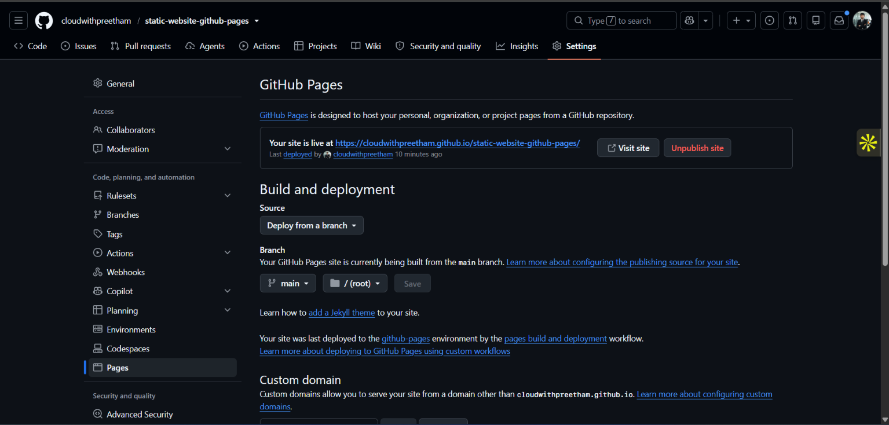
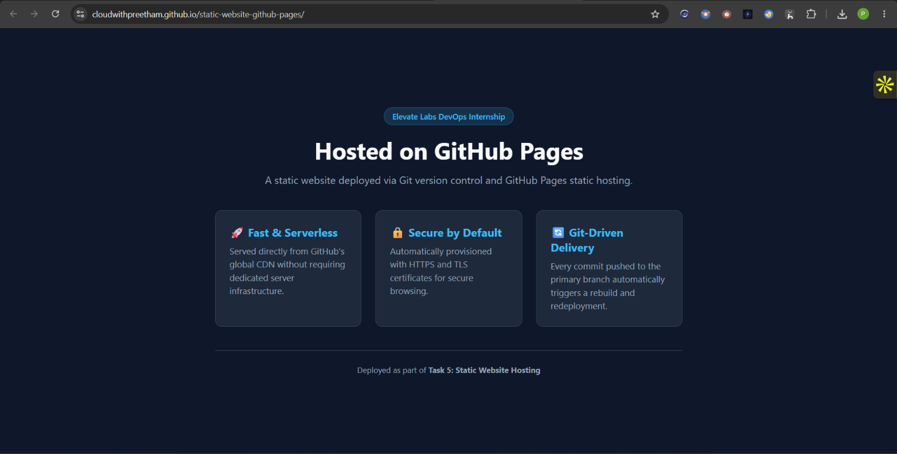

# Host a Static Website with GitHub Pages — Elevate Labs DevOps Internship

[](https://github.com/cloudwithpreetham/static-website-github-pages/actions)
[](https://cloudwithpreetham.github.io/static-website-github-pages/)
[](https://opensource.org/licenses/MIT)

A lightweight, responsive web application deployed using Git version control and hosted serverless on GitHub Pages.

---

## 📌 Project Overview

- **Internship:** Elevate Labs DevOps Internship
- **Task:** Task 6 — Host a Static Website with GitHub Pages
- **Live Website URL:** [https://cloudwithpreetham.github.io/static-website-github-pages/](https://cloudwithpreetham.github.io/static-website-github-pages/)
- **GitHub Repository:** [https://github.com/cloudwithpreetham/static-website-github-pages](https://github.com/cloudwithpreetham/static-website-github-pages)
- **Primary Tools:** Git, GitHub, GitHub Pages (CDN hosting), HTML5, CSS3

---

## 🏗️ Architecture & Deployment Flow

```text
[ Developer Local Machine ]
           │
           │  1. git commit -m "feat: design static site"
           │  2. git push origin main
           ▼
[ GitHub Remote Repository (main branch) ]
           │
           │  Automated trigger (Pages build and deploy environment)
           ▼
[ GitHub Pages Pipeline ]
           │
           ├──> Verifies root / (index.html)
           ├──> Issues TLS/SSL certificate
           └──> Propagates assets to GitHub Fastly Global CDN
           │
           ▼
[ Live Production Website (HTTPS) ]
  https://<username>.github.io/<repo-name>/
```

---

## 📁 Repository Structure

```text
static-website-github-pages/
├── index.html          # Primary semantic HTML5 entrypoint
├── style.css           # Modern responsive design & layout stylesheet
├── docs/screenshots/        # Proof of live deployment and settings configuration
│   ├── 1-github-pages-settings.png
│   └── 2-live-website.png
└── README.md           # Comprehensive project documentation & interview Q&A
```

---

## 🚀 Setup & Deployment Walkthrough

### 1. Local Initialization

Create the project workspace and initialize version control:

```bash
mkdir -p static-website-github-pages
cd static-website-github-pages
git init -b main
```

### 2. Website Construction

Create the root HTML and CSS assets:

- `index.html`: Contains semantic markup, viewport meta tags, header, feature cards, and footer.
- `style.css`: Contains CSS variables, responsive typography, flexbox/grid layouts, and responsive media queries.

### 3. Commit and Remote Configuration

Push the codebase to a new public GitHub repository:

```bash
git add index.html style.css
git commit -m "feat: setup static site HTML and CSS"
git remote add origin https://github.com/cloudwithpreetham/static-website-github-pages.git
git push -u origin main
```

### 4. Enable GitHub Pages Deployment

1. Navigate to the repository on GitHub.
2. Go to **Settings** → **Pages** (under the "Code and automation" section).
3. Under **Build and deployment** → **Source**, ensure **Deploy from a branch** is selected.
4. Set **Branch** to `main` and directory to `/ (root)`.
5. Click **Save**.
6. Wait 60–90 seconds for GitHub's automated build and deployment runner to complete. The live URL will be displayed at the top of the Pages settings page.

---

## 📸 Deployment & Verification Evidence

### 1. GitHub Pages Configuration



### 2. Live Site in Production



---

## 💡 Technical Interview Q&A (Task 6)

### 1. What is GitHub Pages?

**GitHub Pages** is a static web hosting service provided directly by GitHub. It reads HTML, CSS, JavaScript, and static media files directly from a designated branch or directory of a GitHub repository, processes them (optionally through Jekyll), and serves them directly over the internet via GitHub's global Content Delivery Network (CDN) with automated HTTPS encryption.

---

### 2. Can you host dynamic apps here?

**No, GitHub Pages does not support server-side dynamic applications.**

- It does **not** execute server runtimes like Node.js, Python/Django/Flask, Ruby on Rails, Java, or PHP.
- It cannot maintain server-side database connections (e.g., PostgreSQL, MongoDB, MySQL).
- **Client-Side Dynamics Allowed:** Single Page Applications (SPAs) built with React, Vue, or vanilla JavaScript can still run on GitHub Pages because code execution occurs entirely inside the client's web browser, and external APIs can be queried using `fetch` or `Axios`.

---

### 3. What are the limits of GitHub Pages?

GitHub Pages enforces standard usage limits to ensure service reliability:

- **Repository Size:** Repositories hosting Pages sites should ideally stay under 1 GB.
- **Published Site Size:** The maximum deployed site size is 1 GB.
- **Bandwidth Limit:** A soft bandwidth limit of 100 GB per month.
- **Build Frequency:** A soft limit of 10 builds per hour.
- **Prohibited Uses:** Commercial transactions/e-commerce processing, crypto mining, or handling sensitive/confidential data.

---

### 4. How do you update the website?

Updates are entirely Git-driven:

1. Modify your files locally (e.g., edit `index.html` or `style.css`).
2. Stage, commit, and push changes to the configured publishing branch:

   ```bash
   git add .
   git commit -m "feat: update layout styling and content"
   git push origin main
   ```

3. GitHub automatically triggers a deployment workflow under the **Actions** tab (`pages-build-deployment`). Within 1 to 2 minutes, the updated content propagates across the CDN edge nodes.

---

### 5. What happens when you delete the repo?

Deleting the GitHub repository **immediately unpublishes** the associated GitHub Pages website.

- The live deployment URL (`https://<username>.github.io/<repo-name>/`) will immediately return an `HTTP 404 Not Found` response.
- All stored static files, commit histories, and custom domain configurations tied to the repository are permanently purged.

---

### 6. What is the default file that loads?

`index.html` is the default root entry document that GitHub Pages web servers serve when a visitor accesses the root path (`/`). If `index.html` is missing, GitHub Pages will fall back to `README.md` (rendering it via Jekyll), or return a `404` error page if neither exists.

---

### 7. Can you use a custom domain?

**Yes.** GitHub Pages natively supports custom top-level domains and subdomains (e.g., `www.example.com` or `devops.example.com`).

**Configuration Steps:**

1. **GitHub Settings:** Under repository **Settings** → **Pages** → **Custom domain**, enter your domain name and click **Save** (this commits a `CNAME` file to the root of your branch).
2. **DNS Records (at your domain registrar):**
   - For an **Apex Domain** (`example.com`), create `A` records pointing to GitHub Pages IP addresses:

     ```text
     185.199.108.153
     185.199.109.153
     185.199.110.153
     185.199.111.153
     ```

   - For a **Subdomain** (`www.example.com`), create a `CNAME` record pointing to `<username>.github.io`.

3. **HTTPS Verification:** Once DNS propagation completes, check the **Enforce HTTPS** box in GitHub Pages settings.
